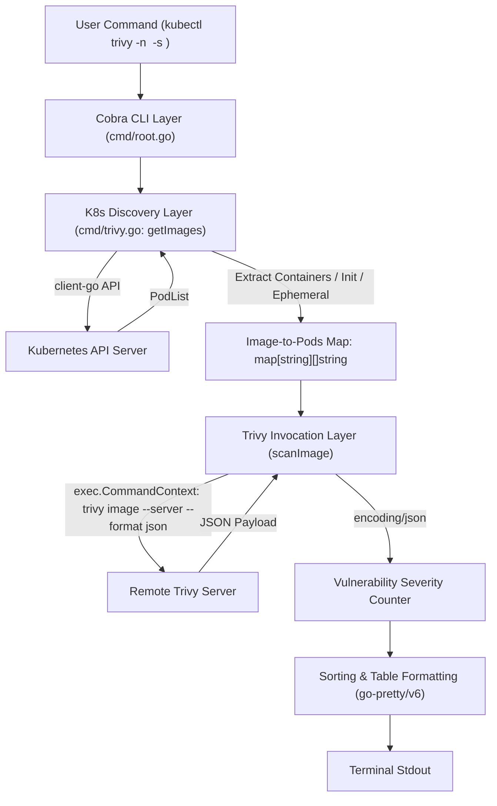

# Technical Specification: `kubectl-trivy`

This document defines the technical architecture, data schemas, component interactions, and execution flow for `kubectl-trivy`, a lightweight Kubernetes CLI (`kubectl`) plugin written in Go.

---

## 1. Overview & Goals

### 1.1 Overview
`kubectl-trivy` connects to a Kubernetes cluster via `client-go`, discovers all container images (main application containers, init containers, and ephemeral debugging containers) running within a specified namespace, and queries a remote Trivy vulnerability server (`trivy image --server ... --format json`). Findings are aggregated, categorized by severity, sorted in descending order of severity, and rendered as a terminal table.

### 1.2 Goals
- **Kubernetes Native**: Seamless integration as a `kubectl` plugin (`kubectl trivy`).
- **Complete Pod Container Discovery**: Inspect main `Containers`, `InitContainers`, and `EphemeralContainers`.
- **Zero External Shell Script Dependencies**: Execute `trivy` CLI natively using `exec.CommandContext` without requiring `bash` or `jq`.
- **Clean JSON Parsing**: Parse Trivy JSON output directly into Go structs via `encoding/json`.
- **Comprehensive Severity Reporting**: Support `CRITICAL`, `HIGH`, `MEDIUM`, `LOW`, and `UNKNOWN` severities.

### 1.3 Non-Goals
- Functioning as an in-cluster mutating webhook or continuous controller/operator.
- Storing historical vulnerability scans in a database.

---

## 2. System Architecture & Data Flow



### 2.1 Component Breakdown

1. **CLI Layer (`cmd/root.go`, `main.go`)**:
   - Parses flags (`--namespace`, `--server`, `--kubeconfig`) and environment variables (`KUBE_CONFIG`, `TRIVY_SERVER`).
   - Initializes command context (`cmd.Context()`) for graceful termination and signals.

2. **Kubernetes Discovery Layer (`cmd/trivy.go: getImages`)**:
   - Uses `client-go` (`kubernetes.NewForConfig`) to fetch `PodList` in target namespace.
   - Iterates through `pod.Spec.Containers`, `pod.Spec.InitContainers`, and `pod.Spec.EphemeralContainers`.
   - Aggregates pod references into a `map[string]map[string]struct{}` to deduplicate pods per unique container image URL.

3. **Trivy Invocation & JSON Processing Layer (`cmd/trivy.go: scanImage`)**:
   - Formats the `--server` address (handling `http://`, `https://`, and raw `host:port`).
   - Invokes `exec.CommandContext(ctx, "trivy", "image", "--server", serverURL, "--format", "json", image)`.
   - Unmarshals stdout into `TrivyReport` Go struct.
   - Counts occurrences of severities (`CRITICAL`, `HIGH`, `MEDIUM`, `LOW`, `UNKNOWN`).

4. **Table Rendering & Output Layer (`cmd/trivy.go: showScanResult`)**:
   - Sorts findings by severity priority: `CRITICAL > HIGH > MEDIUM > LOW > UNKNOWN`.
   - Uses `github.com/jedib0t/go-pretty/v6/table` to render ASCII output tables to `os.Stdout`.

### 2.2 Trivy Version Compatibility

- **Minimum supported version**: **Trivy `v0.29.0`**. That release moved remote scanning from the
  standalone `trivy client` subcommand to `--server` as a flag on `trivy image`, which is the
  invocation this architecture specifies (§2.1, item 3). Anything older cannot serve
  `trivy image --server` and is out of scope.
- **Recommended version**: the latest stable Trivy release (`v0.72.0` at the time of writing) for
  current vulnerability DB coverage and security fixes. The `trivy image --server --format json`
  contract and the JSON fields consumed in §3.2 (`Results[].Vulnerabilities[].Severity`) are stable
  across `v0.29.0`+, so no upper bound is pinned.
- **Client/server pairing**: run the same Trivy release on both sides. Trivy does not guarantee
  RPC compatibility across mismatched client and server versions.
- **Migration status**: `cmd/trivy.go` has not yet been migrated to this invocation (see
  `docs/plan.md`, Task 4) and still shells out to `trivy client`, which upstream removed in
  `v0.29.0`. Until Task 4 lands, the built binary cannot talk to a Trivy version this spec
  supports; the README Prerequisites section documents that legacy constraint for the current
  build, and flips to `v0.29.0`+ with Task 4.

---

## 3. Data Schemas & Types

### 3.1 Internal Result Representation

```go
type vulResult struct {
	image     string
	pods      string
	critical  int
	high      int
	med       int
	low       int
	unknown   int
	supported bool
}
```

### 3.2 Trivy JSON Schema Go Structs

```go
type TrivyReport struct {
	Results []TrivyResult `json:"Results"`
}

type TrivyResult struct {
	Target          string          `json:"Target"`
	Class           string          `json:"Class"`
	Vulnerabilities []Vulnerability `json:"Vulnerabilities"`
}

type Vulnerability struct {
	VulnerabilityID string `json:"VulnerabilityID"`
	PkgName         string `json:"PkgName"`
	InstalledVersion string `json:"InstalledVersion"`
	Severity        string `json:"Severity"` // CRITICAL, HIGH, MEDIUM, LOW, UNKNOWN
}
```

---

## 4. Interface & Configuration Specification

### 4.1 CLI Flags

| Flag Name | Short | Default Value | Environment Variable | Description |
|---|---|---|---|---|
| `--namespace` | `-n` | `default` | - | Target Kubernetes namespace |
| `--server` | `-s` | `127.0.0.1:8080` | `TRIVY_SERVER` | Remote Trivy server endpoint |
| `--kubeconfig` | | `~/.kube/config` | `KUBE_CONFIG` | Path to kubeconfig configuration |

### 4.2 Terminal Table Schema

| Image | Pods | Critical | High | Medium | Low | Unknown |
|---|---|---|---|---|---|---|
| `nginx:1.19.1` | `web-a, web-b` | 4 | 25 | 42 | 18 | 2 |
| `alpine:latest` | `debug-pod` | 0 | 0 | 0 | 0 | 0 |
| `malformed:v1` | `bad-pod` | -1 | -1 | -1 | -1 | -1 (Unsupported) |

---

## 5. Error Handling Strategy

1. **Kubeconfig / API Server Failures**:
   - Invalid `kubeconfig` or RBAC error returns an explicit error message to stderr and exits with status `1`.
2. **Namespace Not Found / Empty Namespace**:
   - Prints friendly warning: `Namespace <ns> not found` or `Found 0 pods in namespace <ns>`.
3. **Trivy Server Execution Failures**:
   - If Trivy execution fails (unreachable server, non-zero exit code), the image is marked `supported = false`.
   - The output table displays `-1` for vulnerability counts with status `Unsupported`.
4. **Context Cancellations**:
   - All external processes (`exec.CommandContext`) listen to OS interrupt signals (`SIGINT`, `SIGTERM`) for clean cancellation.

---

## 6. Security Considerations

- **No Shell Injection**: Using `exec.CommandContext("trivy", args...)` directly prevents shell injection vectors present in legacy `bash -c` concatenation.
- **Read-Only K8s Access**: Requires read-only `list` / `get` permissions on `pods` within target namespaces.
